# Social Media to Cobalt.tools Auto-Extractor

A Tampermonkey userscript that automatically redirects social media links to [cobalt.tools](https://cobalt.tools/) and extracts content without manual intervention.

## 🌟 Features

- ✅ **Multi-Platform Support**: Works with Facebook, Instagram, TikTok, and VK
- ⚡ **Automatic Redirect**: Instantly redirects social media links to cobalt.tools
- 🤖 **Auto-Fill & Submit**: Automatically fills and submits the extraction form
- ⏱️ **Smart Timing**: Built-in delays to bypass security measures
- 🔒 **Privacy-Focused**: No clipboard monitoring, uses temporary storage only
- 🧹 **Auto-Cleanup**: Removes stored data after extraction

## 🎯 Supported Platforms

| Platform | Supported URLs |
|----------|----------------|
| **Facebook** | `facebook.com/*`, `fb.watch/*`, `m.facebook.com/*` |
| **Instagram** | `instagram.com/*`, `www.instagram.com/*` |
| **TikTok** | `tiktok.com/*`, `www.tiktok.com/*`, `vm.tiktok.com/*` |
| **VK** | `vk.com/*`, `www.vk.com/*`, `m.vk.com/*` |

## 📦 Installation

### Prerequisites
- A modern web browser (Chrome, Firefox, Edge, Opera, etc.)
- [Tampermonkey](https://www.tampermonkey.net/) browser extension

### Steps

1. **Install Tampermonkey**
   - [Chrome Web Store](https://chrome.google.com/webstore/detail/tampermonkey/dhdgffkkebhmkfjojobhggbjcnjmflpf)
   - [Firefox Add-ons](https://addons.mozilla.org/en-US/firefox/addon/tampermonkey/)
   - [Microsoft Edge Add-ons](https://microsoftedge.microsoft.com/addons/detail/tampermonkey/iikmkjmpaadaobahmlepeloendndfphd)

2. **Install the Script**
   - Click on the Tampermonkey icon in your browser
   - Select "Create a new script"
   - Delete the default code
   - Copy and paste the script 
   - Press `Ctrl+S` (or `Cmd+S` on Mac) to save

3. **Done!** The script will now run automatically

## 🚀 Usage

1. **Visit any supported social media link** in your browser:
   ```
   https://www.facebook.com/username/videos/123456789/
   https://www.instagram.com/p/ABC123/
   https://www.tiktok.com/@user/video/1234567890
   https://vk.com/video-123456789_456789012
   ```

2. **The script automatically**:
   - Detects the platform (Facebook, Instagram, TikTok, or VK)
   - Redirects you to cobalt.tools
   - Waits 6 seconds for security checks
   - Fills in your original URL
   - Waits 3 seconds for processing
   - Clicks the submit button (`>>`)
   - Starts the content extraction

3. **Download your content** from cobalt.tools

## ⚙️ How It Works

```mermaid
graph LR
    A[Visit Social Media Link] --> B[Script Detects URL]
    B --> C[Store Original URL]
    C --> D[Redirect to cobalt.tools]
    D --> E[Wait 6 seconds]
    E --> F[Fill Input Field]
    F --> G[Wait 3 seconds]
    G --> H[Click Submit Button]
    H --> I[Extract Content]
    I --> J[Clean Up Storage]
```



### Timing Details

- **6-second delay** before filling the input → Allows cobalt.tools security to initialize
- **3-second delay** after pasting → Gives the site time to process the URL
- **Total: 9+ seconds** of careful timing to avoid anti-bot detection

## 🔧 Configuration

The script works out-of-the-box with optimal settings. If you need to adjust timing:

```javascript
// Delay before filling input (line ~80)
setTimeout(() => {
    // ... code
}, 6000); // Change 6000 to desired milliseconds

// Delay before clicking submit (line ~95)
setTimeout(() => {
    // ... code
}, 3000); // Change 3000 to desired milliseconds
```

## 🛡️ Privacy & Security

- ✅ **No external servers**: All processing happens locally in your browser
- ✅ **Temporary storage**: URLs are stored only during the redirect process
- ✅ **Auto-cleanup**: All stored data is deleted after extraction
- ✅ **No tracking**: The script doesn't collect or transmit any data
- ✅ **Open source**: Full code transparency

## 🐛 Troubleshooting

### Script doesn't work
- Ensure Tampermonkey is enabled
- Check if the script is enabled in Tampermonkey dashboard
- Refresh the page and try again

### Wrong URL is being submitted
- Clear your browser cache
- Disable and re-enable the script
- Check Tampermonkey console for errors

### Extraction fails
- cobalt.tools may be experiencing issues
- The platform may have changed their URL structure
- Try manually visiting cobalt.tools to verify it's working

### Console Logs
Open browser DevTools (F12) and check the Console tab for detailed logs:
```
Facebook URL detected: https://www.facebook.com/...
Redirecting to cobalt.tools...
On cobalt.tools with original Facebook URL from address bar: ...
```

## 📝 Changelog

### Version 2.0
- Added Instagram support
- Added TikTok support
- Added VK support
- Improved platform detection
- Enhanced logging with platform names

### Version 1.0
- Initial release
- Facebook support only
- Basic auto-redirect and form submission

## 🤝 Contributing

Contributions are welcome! Here's how you can help:

1. **Fork the repository**
2. **Create a feature branch**: `git checkout -b feature/amazing-feature`
3. **Commit your changes**: `git commit -m 'Add amazing feature'`
4. **Push to the branch**: `git push origin feature/amazing-feature`
5. **Open a Pull Request**

### Ideas for Contribution
- Add support for more platforms (YouTube, Twitter, Reddit, etc.)
- Improve button detection algorithm
- Add user preferences/settings
- Optimize timing mechanisms
- Enhance error handling

## ⚠️ Disclaimer

This script is provided for educational purposes and personal use only. Users are responsible for:
- Complying with cobalt.tools terms of service
- Respecting copyright and intellectual property rights
- Following platform-specific terms of use
- Using downloaded content legally and ethically

The author is not responsible for any misuse of this script.

## 📄 License

This project is licensed under the MIT License - see the [LICENSE](LICENSE) file for details.

## 🙏 Acknowledgments

- [cobalt.tools](https://cobalt.tools/) - The amazing content extraction service
- [Tampermonkey](https://www.tampermonkey.net/) - Userscript manager
- All contributors and users of this script


**⭐ If this script helped you, please consider giving it a star!**

Made with ❤️ for the community
